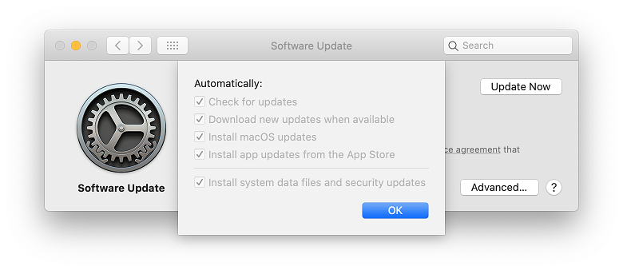

# Managing Software Updates for macOS

Software updates on macOS can be managed by Intune using 2 options.

 - [Update policies for macOS](#Update-policies-for-macOS)
   - Uses commands to trigger installation of updates at device check-in or on a schedule.
 - [Configuring Software Updates on macOS](#Configuring-Software-Updates-on-macOS)
   - Configures the built in Software Updates feature on macOS to do things like automatically install updates and delay install of updates for a certain number of days after release.
   
## Update policies for macOS
This feature is not available in Intune.

> [!NOTE]
> This feature triggers the installation of updates during a device check-in. If reboots are required, they may occur without prompting the user. 

> [!IMPORTANT]
> This feature ignores the **Defer software updates** setting in [macOS - Device Restrictions profile](https://docs.microsoft.com/en-us/mem/intune/configuration/device-restrictions-macos#settings-apply-to-user-approved-device-enrollment-automated-device-enrollment-supervised).
   
## Configuring Software Updates on macOS
macOS allows the deployment of custom profiles to configure settings. Software Updates on macOS can be configured using custom profiles. 

   

### 1. Configure the profile
You can create a custom profile:
 - Manually using Apple documentation
   - [Software Update - Apple Device Management Documentation](https://developer.apple.com/documentation/devicemanagement/softwareupdate).
 - Apple Profile Manager
 - Third-party profile creation tools
 
 You can find an example custom profile here:
 - [Custom - Software Updates.mobileconfig](Example)

### 2. Deploy the profile
The property list can then be uploaded to Intune for deployment using [Add a property list file to macOS devices using Microsoft Intune](https://docs.microsoft.com/en-us/mem/intune/configuration/preference-file-settings-macos). 

### 3. Optional: Configure Defer software updates restiction
You can control how many days after release a software updates is made available to users or installs automatically using the **Defer software updates** setting in [macOS - Device Restrictions profile](https://docs.microsoft.com/en-us/mem/intune/configuration/device-restrictions-macos#settings-apply-to-user-approved-device-enrollment-automated-device-enrollment-supervised).
